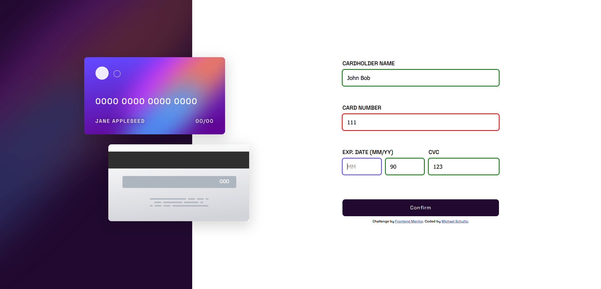

# Responsive Credit Card Form

## Table of contents

- [Responsive Credit Card Form](#responsive-credit-card-form)
  - [Table of contents](#table-of-contents)
    - [Links](#links)
  - [My process](#my-process)
    - [Built with](#built-with)
    - [What I learned](#what-i-learned)
  - [Author](#author)

---

### Links

- Solution URL: [Frontend Mentor](https://www.frontendmentor.io/challenges/interactive-card-details-form-XpS8cKZDWw/hub)
- Live Site URL: [Github Pages](https://ms097530.github.io/Responsive-credit-card-form-using-CSS-grid/)

## My process

First, I planned how I would structure my HTML to facilitate the layout that I wanted to achieve with CSS. This took form first by envisioning how I wanted the mobile layout to differ from larger screen sizes. After settling on a structure, I used CSS custom properties to help with theming and reuse of common values throughout the styling.

I used JavaScript and event listeners to handle input sanitation and validation as well as handle updating the UI after the user successfully submits the form.

### Built with

- CSS custom properties
- Flexbox
- CSS Grid
- Mobile-first workflow
- JavaScript

### What I learned

This project allowed me to dive into ways to sanitize, validate, and handle input in forms. It also gave me an appreciation for the way tools like React handle this.

## Author

- Website - [Michael Schultz](https://mschultz-portfolio.herokuapp.com/)
- Frontend Mentor - [@ms097530](https://www.frontendmentor.io/profile/ms097530)
